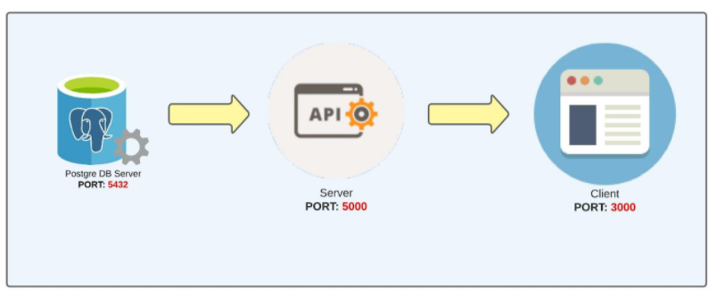

# Lab Docker


## Prerequsite
- [Docker Desktop](https://www.docker.com/products/docker-desktop/)
- [NodeJS LTS](https://nodejs.org/en/)

## Steps
- Dockerize server application by create DockerFile
```shell
Create DockerFile in ./server directory
```

- Build server image from `server` folder
```shell 
    cd server
    docker build -t server .
    docker images
```

- Dockerize client application by create DockerFile
```shell
Create DockerFile in ./client directory
```

- Build client image from `client` folder
```shell
    cd client
    docker build -t client .
```

- Create Docker Compose
```shell
    At root directory
```

- Use Docker compose to start application stack
```shell
    docker-compose up
    docker-compose down
```