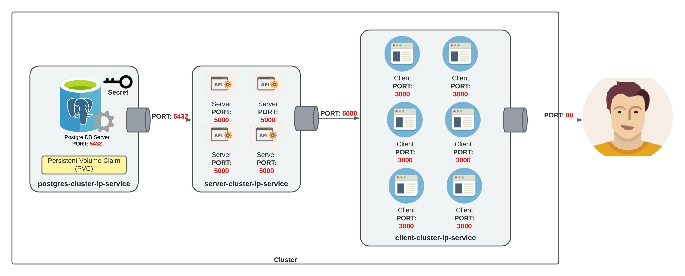

# Lab Kubernetes

## Prerequsite

- [Docker desktop](https://www.docker.com/products/docker-desktop/)
- Switch Kubernetes context to local custer
  ```shell
      # Set current context
      kubectl config get-contexts
      kubectl config use-context docker-desktop
  
      # Exec to alphine container
      kubectl exec -it ${POD_NAME} -- ash
      apk update
      apk add busybox-extras

      # Login to PostgresDB: password(admin)
      kubectl exec -it ${POD_NAME} -- bash
      psql -U admin -W postgres
      # choose DB
      \l
      \c postgres
      \dt
      select * from "Tasks";

      # Resources verification https://kubernetes.io/docs/concepts/configuration/manage-resources-containers/
      kubectl get nodes
      kubectl describe node/docker-desktop
  ```
- Build docker images via docker-compose
  ```shell
  docker-compose --project-name "lab" build
  ```

## Steps

- Create a Persistent Volume Claim(VPC) resource, used as storage for Postgres database
  ```shell
  kubectl apply -f k8s/database-persistent-volume-claim.yaml
  ```

- Create a Secret resource to store database username and password
  ```shell
  kubectl apply -f k8s/database-password-secret.yaml
  ```

- Create a database deployment to deploy Postgres database server which attached to PVC and Secrets

  ```shell
  kubectl apply -f k8s/postgres-deployment.yaml
  ```

- Expose a database cluster to allow another service to access via ClusterIP service on port 5432

  ```shell
  kubectl apply -f k8s/postgres-cluster-ip-service.yaml
  ```

- Create a server deployment to deploy API servers onto a cluster with 1 replicas

  ```shell
  kubectl apply -f k8s/server-deployment.yaml
  ```

- Expose API servers to external world via LoadBalancer service on port 5000

  ```shell
  kubectl apply -f k8s/server-cluster-ip-service.yaml
  ```

- Create a client deployment to deploy client website onto a cluster with 1 replicas

  ```shell
  kubectl apply -f k8s/client-deployment.yaml
  ```

- Expose client website to external world via LoadBalancer service on port 80

  ```shell
  kubectl apply -f k8s/client-cluster-ip-service.yaml
  ```

- Verify all resources via kubectl commands

  ```shell
  kubectl get all -o wide
  ```

- Open the client website http://localhost
- You can make call to API server: http://localhost:5000, or [Postman](NTC.postman_collection.json)

## Useful Commands

```shell
# get resources
kubectl get all -o wide

# Execute into pod
kubectl exec -it pod/client-deployment-687cf56d5f-lh87v -- ash

# Scale Pods
kubectl scale --current-replicas=1 --replicas=2 deployment.apps/server-deployment
curl.exe --location --request GET 'http://localhost:5000/healthcheck'
```

Useful Link:

- Cheatsheet: https://kubernetes.io/docs/reference/kubectl/cheatsheet/
